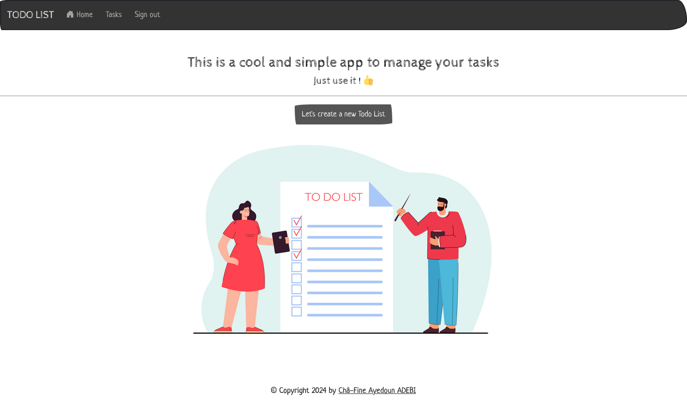
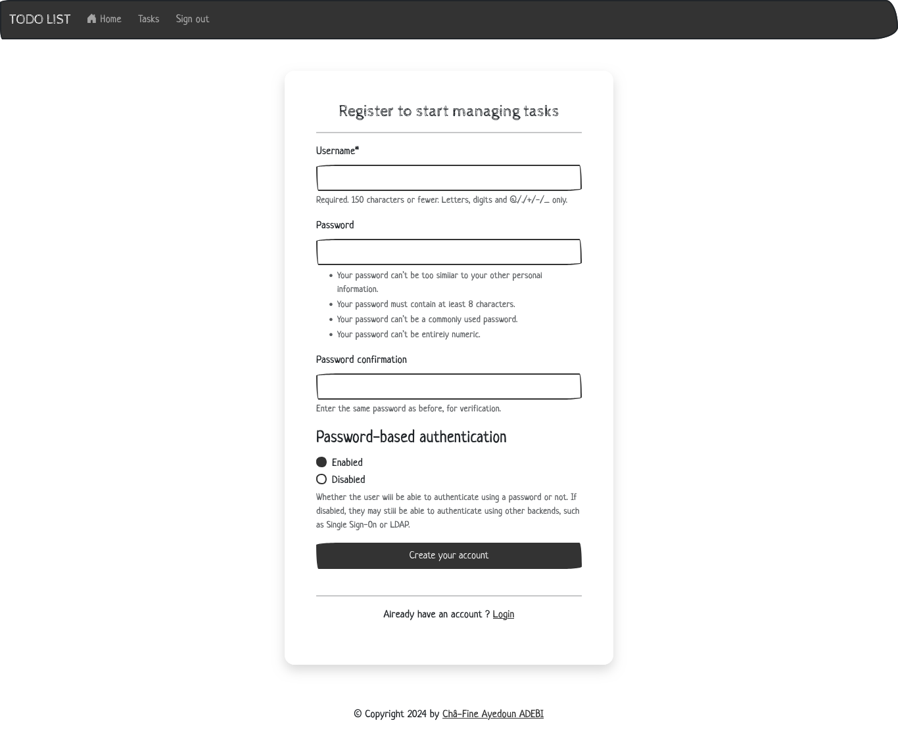
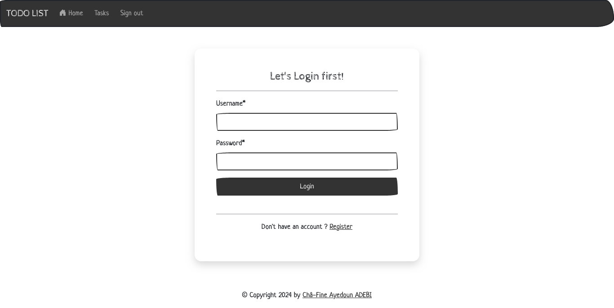
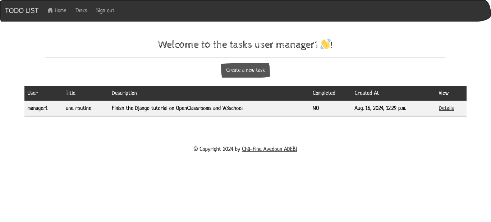

Voici comment vous pouvez structurer le README et la LICENSE pour votre projet Django de to-do list, en incluant les images situées dans `todo/static/images/`.

### README.md

```markdown
# Django To-Do List Application

This is a Django-based to-do list application that allows authenticated users to manage their tasks efficiently. The application supports task creation, updating, deletion, and viewing, all within a user-friendly interface.

## Features

- User authentication (login, logout, registration)
- Create, update, delete, and view tasks
- Responsive design with Bootstrap
- Dashboard for managing tasks

## Screenshots

### Home Page


### Register Page


### Login Page


### Task Management


### And More Just clone and enjoy !


## Installation


### Prerequisites
- Python 3.12+
- Django 5.1+
- Virtual environment (recommended)

### Setup

1. **Clone the repository**:
   ```bash
   git clone https://github.com/memlens/todo-list.git
   ```
   
2. **Navigate to the project directory**:
   ```bash
   cd todo-list
   ```

3. **Create and activate a virtual environment**:
   ```bash
   python3 -m venv env
   source env/bin/activate  # On Windows use `env\Scripts\activate`
   ```

4. **Install the dependencies**:
   ```bash
   pip install -r requirements.txt
   ```

5. **Apply the migrations**:
   ```bash
   python manage.py migrate
   ```

6. **Run the development server**:
   ```bash
   python manage.py runserver
   ```

7. **Access the application**:
   Open your web browser and go to `http://127.0.0.1:8000/`.

## Usage

- **Register** a new account or **log in** with an existing one.
- **Create** new tasks by clicking the "Add Task" button.
- **Manage** your tasks from the dashboard.

## Contributing

Contributions are welcome! Please feel free to submit a Pull Request or open an Issue.

## License

This project is licensed under the MIT License - see the [LICENSE](LICENSE) file for details.

## Contact

For any inquiries, please contact [chafchafine@gmail.com](mailto:chafchafine@gmail.com).

```


### Notes:

1. **Images**: Replace `home.png`, `tasks.png`, and `authentication.png` with the actual filenames of your images in the `todo/static/images/` directory.
2. **Customization**: Update the `LICENSE` file with your name and the year.
3. **Repository URL**: Replace `https://github.com/memlens/todo-list.git` with the actual URL of your GitHub repository.

Avec ces fichiers, votre projet sera bien documenté sur GitHub, et les utilisateurs pourront facilement voir les fonctionnalités grâce aux images intégrées.